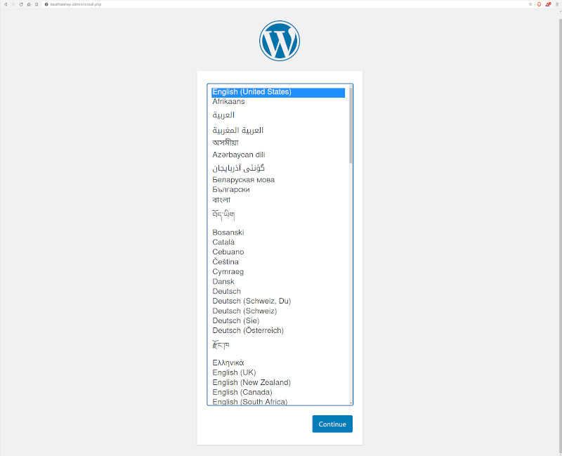

# PHP Basic wordpress - using Docker

## Getting started.

First run

* Create a copy of `.env.dist` as `.env` and modify the details as needed.
* Run `docker compose up -d` to start the containers.
* Navigate to `http://localhost`. 
    * However, If you have changed the `WP_APP_PUBLIC_PORT` in the `.env`, navigate by point to that point. e.g. if `WP_APP_PUBLIC_PORT` is set to `8080`, then navigate to `http://localhost:8080`
* You should now be greeted with the configuration screen. 

    
* Select the configuration as needed.
* Once the configuration is finished, it will bring you to the login page.
* At this stage initial setup is finished and the project is ready to be used.
* Login and continue working.

Stop and remove the containers

```
$ docker compose down
```

To remove all WordPress data, delete the named volumes by passing the `-v` parameter:
```
$ docker compose down -v
```